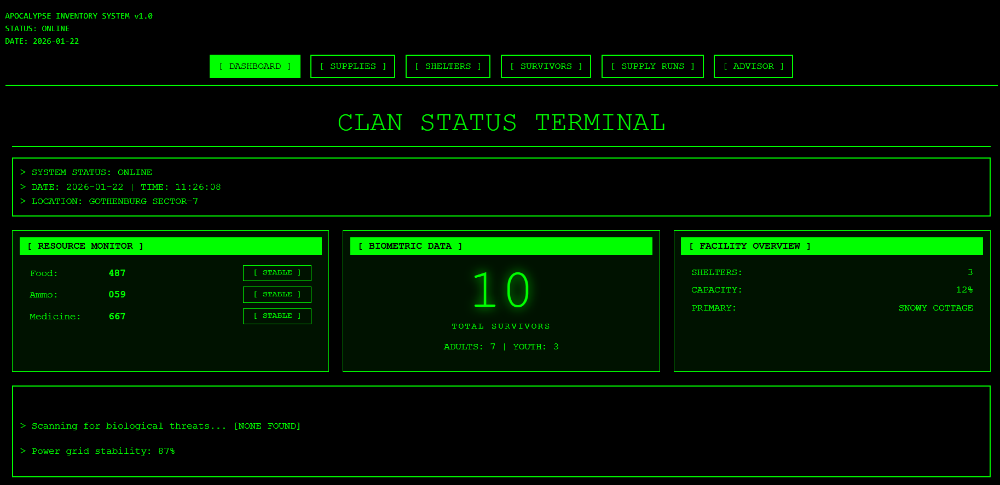

# The_Walking_Deadstocks-tdd-project
“Hur överlever vi zombie-apokalypsen?” Lagerhantering – men för överlevnad

[](https://github.com/Campus-Molndal-CLO25/The_Walking_Deadstocks-tdd-project/actions/workflows/main.yml)

**Kurs:** Test och kvalitetssäkring **Datum:** 2026-01-25 **GitHub:** (https://github.com/Campus-Molndal-CLO25/The_Walking_Deadstocks-tdd-project.git)

---

## 📋 Projektbeskrivning

Efter att ett zombievirus har invaderat jorden är mänskligheten kraftigt reducerad och lever uppdelad i isolerade klaner. Resurser såsom mat, medicin och ammunition är bristvaror och hård konkurrens om resurser råder klaner emellan. Det är planering och optimering av de skrala resurserna som gäller för att överleva! En av alla dessa klaner har tagit saken ett steg längre och bestämt sig för att utveckla ett system - Apocalypse Inventory System - för att kunna hålla järnkoll på vad de har att röra sig med. Allt för att överleva så länge det bara går. 

Klanens medlemmar, **Survivors** lever inom klanrevirets marker utspridda i **Shelters** med ett varierande antal medlemmar i varje. Tillsammans förfogar de över ett gemensamt lager av kritiska resurser såsom mat, ammunition och medicin. Klanledaren är den som basar över det och han överser hur de gemensamma resurserna distribueras mellan olika **Shelters** baserat på hur många **Survivors** som bor i respektive **Shelter**. För att säkerställa klanens överlevnad behöver klanledaren ha full koll på lagersaldo för att kunna planera framtida krigståg, **SupplyRuns** för att kunna fylla upp med **Supplies**.

---

## 🖼️ Screenshots



---

## 🚀 Kom igång

### Förutsättningar

- .NET 8.0 SDK eller senare
- Terminal/kommandotolk

### Installation

Klona repositoryt enligt följande: 

```
    git clone https://github.com/Campus-Molndal-CLO25/The_Walking_Deadstocks-tdd- project.git
	
    cd The_Walking_Deadstocks-tdd-project
```

### API-nyckel

- Skapa API-nyckel för Gemini AI: [https://aistudio.google.com/](https://aistudio.google.com/ "https://aistudio.google.com/")
- Skapa API-nyckel för OpenWeatherAPI: https://home.openweathermap.org/
- Skapa .json-fil > Kalla den settings.json > Lägg den i Documents

Lägg in följande text i json-fil: 
```
{ "OpenWeatherApiKey": "your api key here",  
"GeminiApiKey": "your api key here" }
```
### Körning

```shell
dotnet run
```

Vid första körningen skapas automatiskt:

- `ZombieDb` – Databasen
---

## 📚 Funktioner

- Kan lägga till och använda material från lagret. 
- Visar lagerstatus och beräknar hur länge lagret väntas räcka. 
- Varning när lagernivåerna går ner till kritiskt låga
- Kan lägga till skyddsrum med namn och lokalisering
- Kan lägga till överlevare med namn och ålder
- Kan planera *supply runs* för att samla mat, medicin och ammunition
- Väderprognoser visar om det är lämpligt att göra *supply runs* eller inte
- AI-konsult som ger överlevnadstips

## 🏗️ Arkitektur och kodstruktur

### Projektstruktur

```
MonsterTracker/
├── Models/
│   ├── Shelter.cs            # Datamodell för shelters
│	├── Supply.cs             # Datamodell för supplies
│   ├── SupplyRun.cs          # Datamodell för supplyruns
│   └── Survivor.cs           # Datamodell för survivours
├── Data/
│   ├── ShelterRepository     # CRUD för Shelter
│   ├── SupplyRepository.cs   # CRUD för Supply
│   ├── SurvivorRepository.cs # CRUD för Survivor
│   ├── DataFacade.cs         # Facade-mönster
│   └── MyZombieDataContext.cs # 
├── Services/
│   ├── ApiKeyState.cs        # 
│   ├── GeminiService.cs      #
│   ├── MissionService.cs     #
│   ├── OpenWeatherService.cs #
│   └── AppSettingsStore.cs   #     
├── Program.cs                # Programinmatningspunkt
└── Zombie.db                 # Databas (skapas vid körning)
```

## 🐛 Kända buggar och begränsningar

Inga kända buggar för närvarande

## 🙏 Erkännanden och källor

### Hjälp och samarbete

- **Lärare:** Undervisning under lektioner
- **Kurskamrater:** Diskussioner i gruppen gällande testning
- **AI-verktyg:** Vi har använt ChatGPT samt Gemini för delar av vår kodning. 

---
## 📄 Licens

Detta projekt är skapat som en del av kursen Testning och kvalitetssäkring vid Campus Mölndal.

---

## 📬 Kontakt

**Student:** [Martina Halldin] **Email:** [82marhal@gafe.molndal.se] **GitHub:** [82marhal-bot]
**Student:** [Karin Roman] **Email:** [76karrom@gafe.molndal.se] **GitHub:** [76karrom]
**Student:** [Tom Ekstrand] **Email:** [02tomeks@gafe.molndal.se] **GitHub:** [Xnenon02]

---

**Skapad:** [2026-01-22] **Senast uppdaterad:** [2026-01-22]